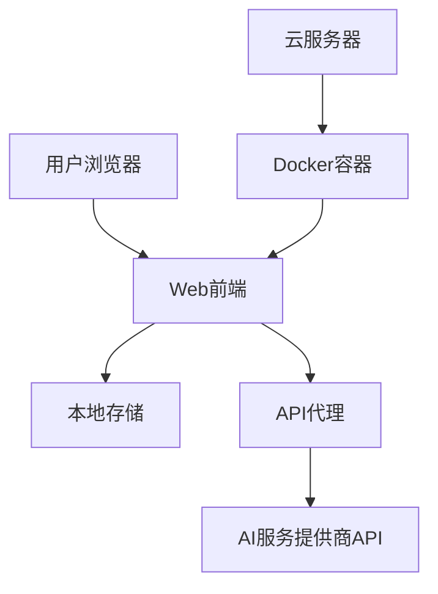

# Design Document

## Overview

本设计文档详细说明了如何将Prompt Optimizer项目改造为专注于Web服务的商业化版本。我们将保留项目的核心功能，同时移除不适用于Web服务的组件，并进行必要的品牌和许可声明修改。

## Architecture

改造后的项目将采用以下架构：

1. **前端**：保留Vue.js前端框架，专注于Web界面优化
2. **后端**：保留API代理功能，用于解决跨域问题
3. **部署**：优化Docker和云服务器部署配置
4. **存储**：保留浏览器本地存储功能，考虑添加可选的服务器端存储

## Components and Interfaces

### 1. 核心组件

保留的核心组件包括：

- **packages/core**: 核心业务逻辑和服务
- **packages/ui**: UI组件库
- **packages/web**: Web应用入口
- **api**: API代理功能

### 2. 需要移除的组件

以下组件将被移除或禁用：

- **packages/desktop**: 桌面应用相关代码
- **packages/extension**: Chrome插件相关代码
- 桌面应用特有的功能和配置

### 3. 需要修改的组件

以下组件需要进行修改：

- **README.md**: 更新项目描述、部署指南和许可声明
- **package.json**: 移除不必要的依赖和脚本
- **docker-compose.yml**: 优化Docker配置
- **环境变量配置**: 简化和优化环境变量

## Data Models

数据模型保持不变，主要包括：

1. **模型配置**: 存储AI模型的配置信息
2. **提示词模板**: 存储提示词模板
3. **历史记录**: 存储用户的提示词历史
4. **用户偏好**: 存储用户界面偏好设置

## Error Handling

错误处理策略将进行以下优化：

1. **API错误处理**: 增强API错误的捕获和显示
2. **跨域错误处理**: 优化跨域错误的提示和解决方案
3. **日志记录**: 添加更详细的错误日志记录
4. **用户反馈**: 改进错误信息的用户友好显示

## Testing Strategy

测试策略将包括：

1. **单元测试**: 保留现有的单元测试
2. **集成测试**: 专注于Web应用的集成测试
3. **部署测试**: 添加Docker部署的测试
4. **性能测试**: 添加Web服务的性能测试

## Implementation Plan

实施计划将分为以下几个阶段：

1. **项目结构调整**: 移除不必要的组件和依赖
2. **许可和品牌更新**: 修改许可声明和品牌元素
3. **部署配置优化**: 优化Docker和云服务器部署配置
4. **功能测试和验证**: 确保所有Web功能正常工作
5. **文档更新**: 更新部署和使用文档

## Security Considerations

安全考虑包括：

1. **访问控制**: 默认启用密码保护
2. **API密钥保护**: 增强API密钥的安全存储
3. **数据隐私**: 确保用户数据的隐私保护
4. **依赖安全**: 定期更新依赖以修复安全漏洞